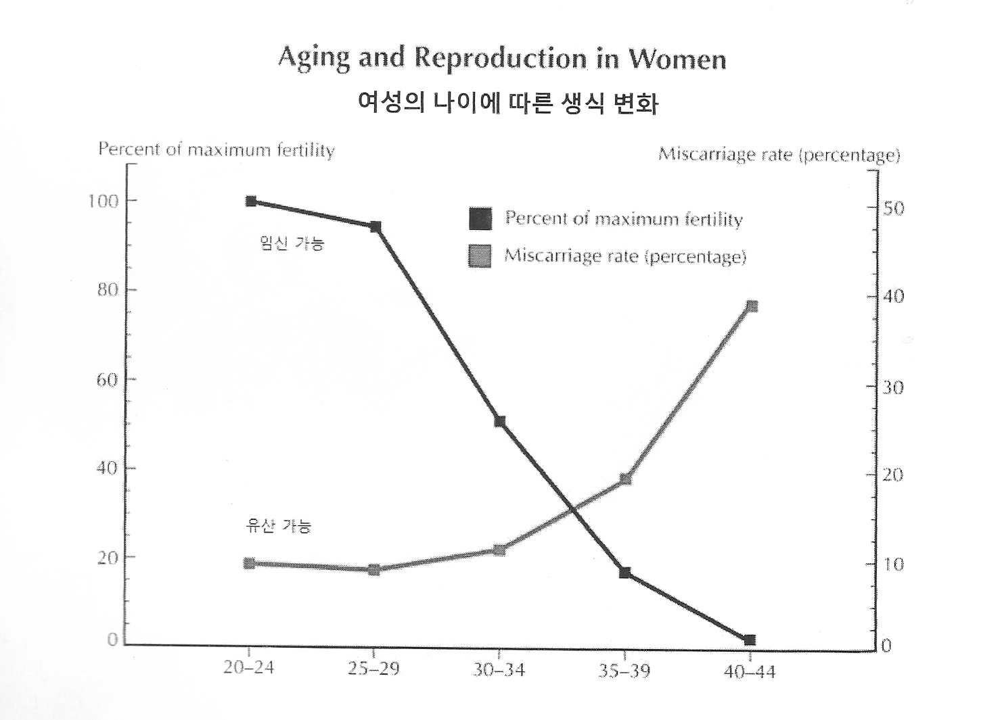
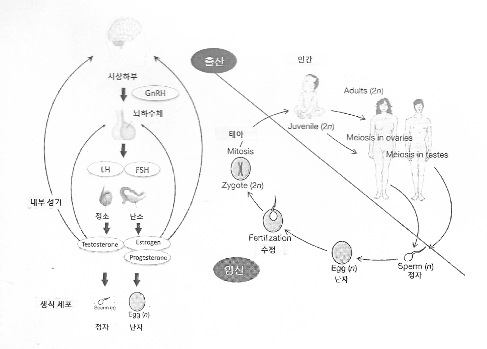
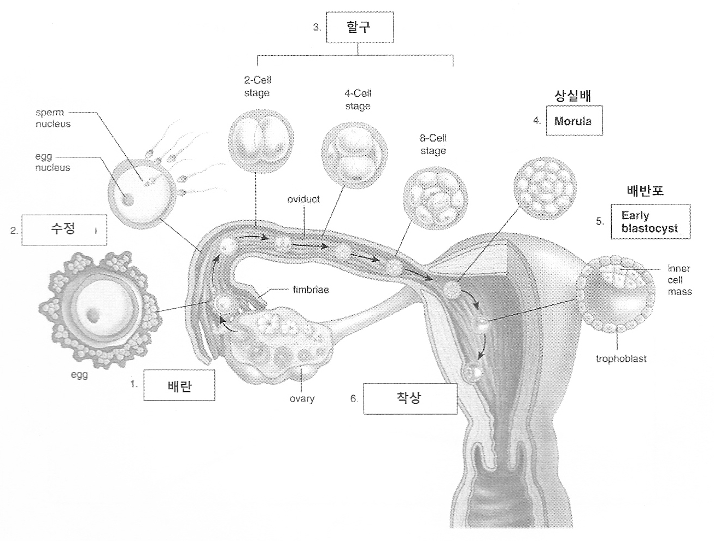
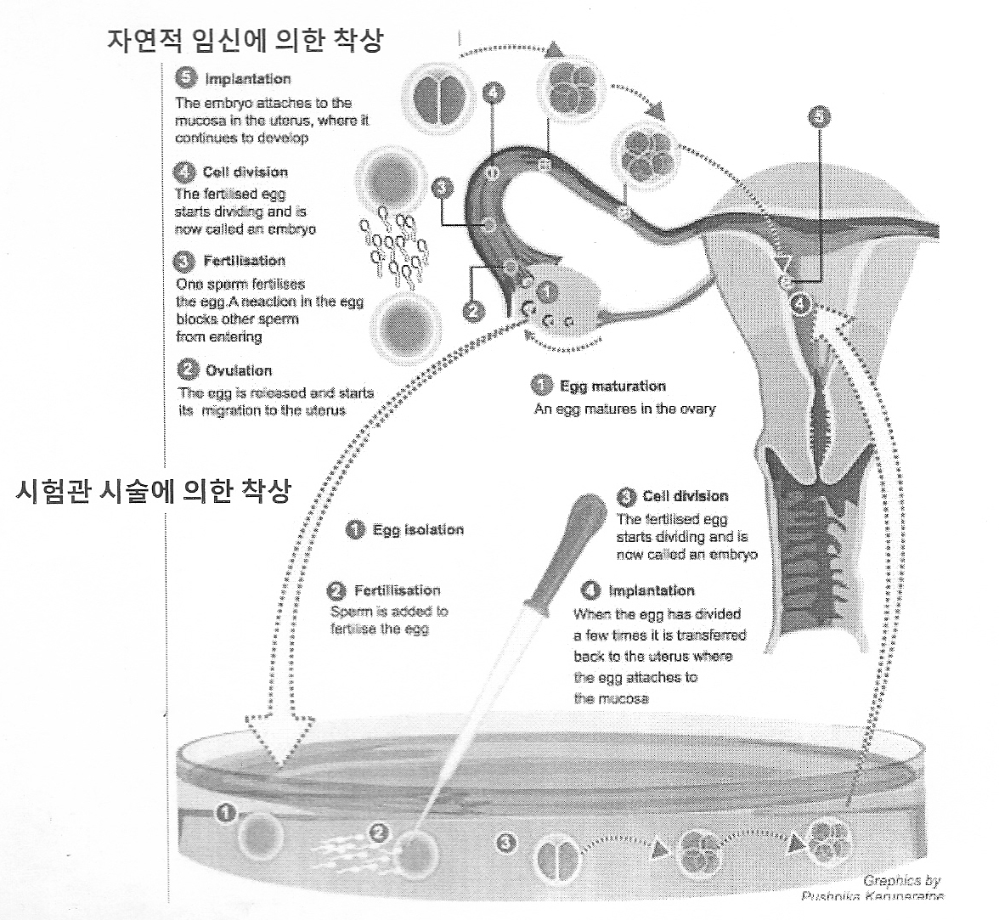
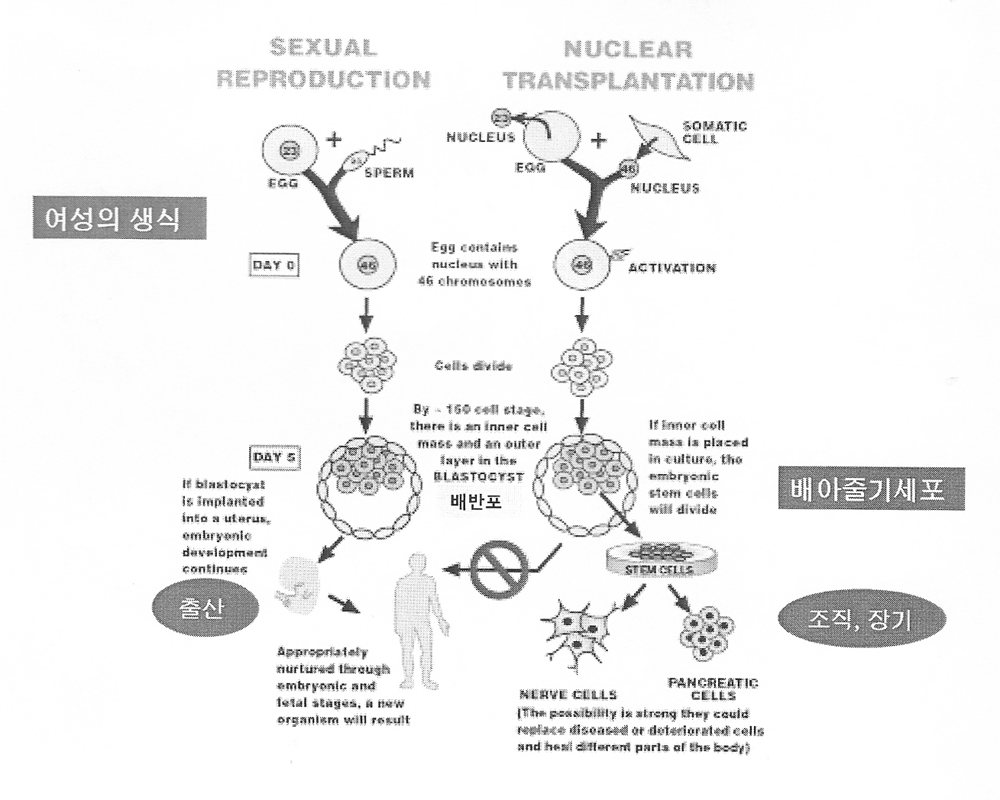
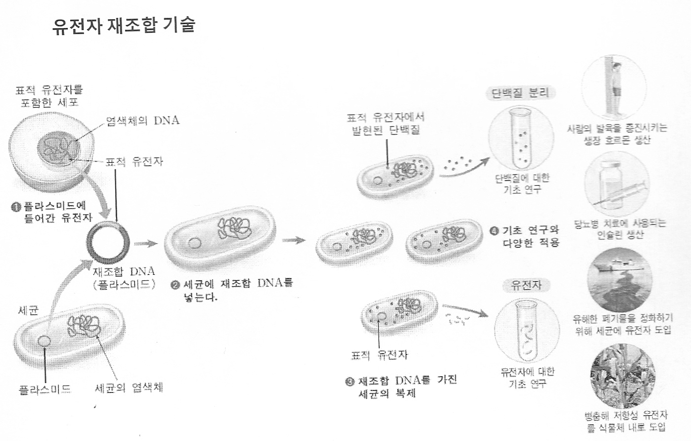

<h4 style="text-align:center"> 

<영화로 얘기해보는 ‘낙태죄’ 폐지와 재생산 정치, 두번째> ‘낙태죄’와 ‘Prolife’ _후니 

</h4>

<h5 style="text-align:center"> 

지구지역행동네트워크(NGA) 적녹보라 의제행동센터 상반기 특강

</h5>

행사 정보 보기(<a href="https://twitter.com/NGASF/status/902433006287175680" targt="_blank">링크</a>)

*이 녹취록의 내용은 NGA의 사전허가를 받고 게시합니다.  삽입된 사진은 행사 당일 배포된 스캔본에서 부분발췌했습니다.

*발언 내용중 구어적인 표현들 일부는 윤문하였습니다.

---

###### 프로쵸이스의 이웃이 된 프로라이프 

<a href="http://movie.daum.net/moviedb/main?movieId=55922" targt="_blank">델라웨어 12번가(12 & Delaware)</a>는 2010년도에 개봉했는데, 1990년대에 프로라이프와 프로쵸이스 세력이 팽팽하게 대치하던 상황들이 영화안에서 쭉 이어 보여집니다. 화면에 보이는 것이 영화의 한 장면인데요. 오른쪽에 보이는 장소가 91년도에 세워진 낙태시술을 하던 클리닉이고, 반대편 건물은 프로라이프 측이 99년도에 구입한 건물입니다. 프로라이프 세력은 이 건물을 기점으로 그 앞에서 낙태 반대 시위를 하기도 하고, 반대편 클리닉 건물에 들어가는 여성들에게 “생명은 소중하다.”느니 뭐, 이런 얘기를 하면서 막아서서 설득에 나서기도 합니다. 이런 장면들이, 이들이 낙태 클리닉에서 일하는 사람들을 24시간 감시하는 모습과 함께 영화에 등장합니다. 그런데, 여기서 프로라이프는 스스로 너무 당당하게 행동하고 프로쵸이스 측은 너무 위축된 모습으로 묘사되기 때문에 저는 처음에 좀 헷갈릴 지경이었어요. 어떻게 보자면 다소 으스스한 분위기에서 영화가 진행된다고 볼 수 있어요.

제가 낙태죄 관련 주제중에서 프로라이프를 고른 이유를 잠깐 설명드려야 할 것 같습니다. 사실 한국에서는 프로라이프 세력이 그렇게까지 영향력을 가지고 있진 않은데요, 미국 같은 경우는 상황이 다릅니다. 저는 그 상황의 배경과, 프로라이프 세력이 낙태 이외에도 관여하고 있는 부분을 설명드리고 싶습니다. 시간 말미에 설명드리겠지만 프로라이프는 생명과학 분야의 연구까지도 굉장히 깊게 관여를 하고 있고, 이득도 얻고 있습니다. 또한 미국 정부 요직에도 프로라이프를 지지하는 사람들이 있는 상태입니다. 조금 더 넓은 시각에서 프로라이프를 바라볼 필요를 느꼈어요. 또한, 낙태죄를 폐지한 이후의 상황도 문제라는 것을 말하고 싶었습니다. 그 ‘죄’가 없어진다하더라도, 어떤식으로든 여성의 신체에 제약을 가하는 방법은 무궁무진하게 있거든요. 한국 같은 경우는 형법상에서 낙태를 죄로 규정하고 있는데, 이 죄를 없애는 것 만으로 모든 문제가 해결되지는 않습니다. 그 때부터가 ‘시작’일 것이라는 말을 하고 싶었습니다.

다시 돌아가서, 90년대보다 조금더 올라간 6-70년대 미국의 상황을 간단히 설명드리겠습니다. 60년대 말에서 70년대 초 중반 정도에, 소위 제2세대 페미니즘 물결의 흐름 속에서 가장 집중했던 것이 낙태이슈기도 했습니다. 급진페미니스트라고 불리는 그 사람들이 낙태죄를 둘러싸고 정말 전투적으로 싸우기 시작했습니다. 뉴욕에서 그 일이 일어나는데, 여기 보이는 사진은 ‘입법 공청회’ 당시의 장면입니다. 그 옆에는 ‘Speak Out’이라는 이름의 낙태 경험 말하기 모임 장면이고요. 1970년대에는 ‘Our Bodies, Ourselves’라는 책이 출간되는데, 이 시기부터는 단순히 의료적인 얘기가 아니라 페미니즘 입장에서 보는 여성의 건강권, 여성이 주체로서 자신의 몸을 바라보는 좐점을 반영한 내용이 들어있었습니다. 영화 <a href="http://movie.daum.net/moviedb/main?movieId=19589" target="_blank">‘더 월(1996, If These Walls Could Talk)’</a>의 두번째 에피소드 장면에서 주인공이 읽고 있는 책으로 잠깐 등장하기도 합니다. 요즘 한국에서 낙태죄 폐지 시위가 열릴 때마다 등장하는 ‘My Body, My Choice(나의 몸, 나의 것)’가 떠오르기도 하죠.

다음으로 여성의 프라이버시, 성적 자기결정권이 낙태죄와 연결되는 지를 미국의 ‘로우 대 웨이드 판결문(1973)’을 통해 살펴보도록 하겠습니다. 판결문을 조금만 자세히 읽어볼게요.

> <로우 대 웨이드 판결문(1973)
> ‘프라이버시 권리는…여성이 자신의 임신을 종결시킬 것인지 결정할 권리를 포함할 만큼 넓은 개념이다.’

원래 이 것이 헌법상의 권리로 규정이 되있었던 권리는 아니라고 합니다. 그럼에도 여성의 임신에 대한 결정권을 프라이버시의 권리로 못을 밖은것이죠.

> …우리는 의학적 상담과 치료를 구하는 여성이 그 특정 주의 주민이든 아니든 간에 그 주는 임신한 여성의 건강(health of the pregnant woman)을 유지하고 보호하는 데 중요하고도 정당한 이익을 가진다는 것과 잠재적인 인간 생명(potentiality of human life)의 보호라는 또 다른 중요하고 정당한 이익을 가진다는 것을 반복하겠다. 이 두이익은 분리되어 있고 고유한(separate and disctinct) 것이다. 각 이익은 출산기일이 다가올수록 실질적으로 증대되며 임신 중의 어떤 시점에 이르면 ‘불가피한(compelling)’ 이익이 된다.

다음으로는 그 두개의 분리된 이익 중에서 어떤 것이 더 우선시되고 중요한 것인지를 나누는 시점을 파악해볼 수 있는데요. 임신 첫 3개월 시기동안에는 잠재적인 인간 생명인 ‘태아’보다 임산부인 ‘여성’의 이익이 더 위에 있다고 규정합니다.

> 임신한 여성의 건강에 대하여 주가 가지는 중요하고도 정당한 이익에 관해서 보면, 현대의학 지식상 ‘불가피한’ 것이 되는 시점은 대략 임신 첫 삼분기가 끝날 무렵이다. 이 시기까지는 낙태로 인한 모성사망률이 보통의 출산과정에서의 모성사망률보다 낮기 때문이다. 따라서 그 시점 이후부터는 주가 낙태 과정에 대하여 모성 건강의 유지와 보호에 합리적 근거를 가진 규제를 할 수 있게 된다는 것이 도출된다…

잠재적 생명에 대해 주가 가지는 중요하고도 정당한 이익에 관해서 보면, ‘불가피한’ 이익으로 되는 시점은 태아의 생존 가능 시점(viability)이다. 왜냐하면 태아가 이제는 모체의 자궁 밖에서 의미 있게 생존할 수 있는 가능성을 가지기 때문이다. 그러므로 자생 가능 시점 이후 태아의 생명을 보호하기 위한 주의 규제는 논리적이며 생물학적인 근거를 가진다…’

여기서 잠깐 ‘프로 쵸이스(Pro-Choice)’라는 말이 나오게된 배경과 일화를 소개드려야 할 것 같아요.

미국시민자유연합이라는 단체가 1964년도에 낙태연구협회와 결합을 했고, 그 곳에서 (급진 페미니스트들에게) 법률 자료를 제공하고 법률 자문도 해주었습니다. 이 때 페미니스트들은 ‘아기(Baby)’를 ‘태아(Fetus)’로 고쳐 부르고, ‘낙태 옹호(Pro-Abortion)’라는 말을 처음에 쓰다가 점차 ‘선택 옹호(Pro-Choice)’라는 말로 대체해나갔다고 합니다. 이것은 아주 의도적인 것이었죠. 여성의 프라이버시에 대한 권리가 낙태 문제에 쉽게 적용이 되도록 문구를 손 본 것이었습니다. 태아와 산모를 연결시키는 단어인 ‘Baby’ 대신에 ‘Fetus’를,  ‘Mother’ 대신에 ‘Pregnant Women(임신한 여성)’을 쓰는 식으로 페미니스트 중심의 언어를 일부러 채택했습니다. 이것은 그 이전 시기에 미국에서 있었던 ‘산아제한 운동’과 관련이 있기도 합니다. 1965년도와 1972년도에 두 번에 판결문에서 ‘피임에 대한 권리’를 ‘프라이버시의 권리’로 인정한 사례가 있었어요. 그 흐름의 연속선상 안에서 로우 대 웨이드 판결이 1973년에 내려진 맥락이 있습니다. 프라이버시의 권리가 피임에서 낙태죄까지 적용을 확대시키겠다는 의도가 있었던 것이죠.

로우 대 웨이드 판결이 내려진 이후의 일들은 어떻게 되었겠습니까. 낙태죄 폐지를 지지했던 사람들, ‘Planned Parenthood(가족계획연맹)’ 같은 단체는 전국적으로 낙태 클리닉을 세우기 시작하는 반면, 반대편인 프로라이프 세력들은 이 판결에 수긍하지 않고 연방 주의회 곳곳에 로비를 하기 시작했습니다. 이 때부터 양측간에 전쟁이 시작되었습니다.

한편, 이때의 ‘프라이버시 권리’라는 개념이 향후 페미니스트들의 발목을 잡는 계기가 되기도 합니다. 미국 수정헌법을 한번 살펴보죠.

> <미국 수정헌법>
> 제14조
> …어떠한 주도 적법절차(due process)에 의하지 아니하고는 어떠한 사람(person)으로부터도 생명, 자유 또는 재산을 박탈할 수 없다.

미국은 연방법과 주법이 이원적인 구도를 만들고 있다는 점을 알아야 합니다. 다시말해, 미국은 전체적으로는 여성에게 임신권에 대한 결정권을 주고 있었던 셈이지만, 주에게 특정 재량권을 줌으로서 세부적인 조항은 각 주가 알아서 만들 수 있었던 상황이 이어지게 된 것이죠. 이점을 이용해서 프로라이프 측에서 택했던 전략에는 온갖것들이 있었습니다. 아주 집요했어요. 다음의 하이드 개정 조항도 그 중 하나입니다.

> <하이드 개정 조항(Hyde Amendment) 제정 (1976)>
> ‘법의 목적이나 효과가 태아의 생존능력을 갖기 전에 낙태를 하려는 여성에게 실질적 장애(substantial obstacle)가 되는 경우’에만 이 법을 무효로 보는 ‘부당한 부담(undue burden)’ 심사기준을 채택.

이것은 낙태에 대한 연방 지원금을 막아버리는 조항이었고 1980년도에 승인이 되었습니다. 말하자면,

> 그래, 여성이 임신을 결정할 수 있다는 권리는 인정을 해주겠다. 하지만 정부가 여성이 낙태를 하는데 필요한 비용까지 일일이 책임져줄 수는 없다.

이런 얘기였던 것이죠. ‘프라이버시의 권리’에 대한 인정이 이런 식의 결과로 나타나기도 했습니다.

이후 1992년도의 로우 대 웨이드 판결을 이어받아 재승인한 펜실베니아 판결 이후로 프로라이프 대 프로쵸이스의 대립은 극심해지기 시작합니다. 아까 영화에서 보셨겠지만, 총격/방화/폭발물 투척 사건들이 일어났고 실제로 매우 심한 피해가 발생하기도 했습니다. 이 때문에 프로라이프 측의 인물을 낙태 클리닉 주변 몇 미터 안으로는 접근을 못하게 막는 법들까지 만들어지기 시작했습니다. 그만큼 대립이 심각했던 것이죠.

프로라이프가 법적으로 여성의 낙태권을 제한했던 방법들은 크게 세가지로 볼 수 있습니다. 한국도 어쩌면 낙태죄 폐지 이후에 이런식으로 법적인 제재가 여성의 신체에 대해서 들어올 수 있을 것 같아요. 봐두시면 도움이 될 수 있을 것 같아서 정리해보았습니다.

- 특정 시점 이후의 임신중지(낙태) 자체를 금지

여기서 특정 시점이란 태아가 생존능력을 가지기 시작한다고 보는 시점입니다. 구체적으로는 6주, 12주, 22주.. 이런 식으로 주마다 다 다르게 규정하고 있어요.

- 세부 규정들로 임신중지(낙태)를 방해

시설기관이나 병원의 규정일 일부러 까다롭게 만든다거나 하는 것이죠. 이 외에도 시술 진행시 의사 2명의 의견을 구해야 한다던가, 시술 방법에 제한을 둔다던가, 시술 전에 반드시 낙태 상담을 해야할 의무를 만든다던가, 상담을 받고나서 낙태시술 하기전까지의 별도 대기기간을 만들어 둔다던가 (24시간부터 일주일일 후까지 등등) 하는 방식으로 세세한 규정을 만듭니다.

- 비용에 직접 개입

1976년의 하이드 법 개정조항 처럼, 낙태 시술에 쓰이는 정부의 공적 기금을 아예 막거나 제한해버리는 것이 여기에 포함됩니다.

현재 2017년의 미국 상황은, 대부분 주에서 여성의 피임에 대한 지원은 확대가 되고 있는 반면 낙태에 대한 규정에 있어서는 세부 법조항들이 늘어나고 있는 추세입니다. 제가 찾아본 자료에 의하면 2017년 1월을 기준으로, 미국의 적어도 절반의 주에서는 낙태를 제한하는 5가지의 주요 법 규정들 중 1가지를 택하였습니다. 2000년도부터 2016년도까지의 한 조사에서는, 낙태를 제한하는 4개의 조항을 둔 주가 기존 13개에서 27개로 늘어났다고 말합니다. 즉, 임신중절(낙태)에 대해 적대적인 주안에서 살고 있는 생식능력을 가진 젊은 여성들의 비율이 미국 전체 여성의 31%에서 51%로 증가한 것이죠.

프로라이프 측은 그들 자신이 마치 ‘생명’을 대표하는 자들인것처럼 굴며, 정치세력화되어 왔습니다. 매해마다 프로쵸이스와 프로라이프 양측의 대형 시가지 퍼레이드가 열리고, 매 대선과 선거기간 마다 낙태는 첨예한 이슈로 떠오릅니다.

다음으로는 의학적인 관점에서 제가 봤을 때, 프로라이프 측이 주장하는 ‘생명’이라는 개념에 대해서, 여러면에서 말이 되지 않는 다고 생각하는 것을 말씀드리고자 합니다.

이 그래프를 보면서, 프로라이프의 말만 듣자면 여성이라는 인간은 20-24세에 가장 열심히 임신을 해야할 것 같잖아요? 하지만 (그들이 권하지 않는다고 해도) 10대에 임신을 하는 여성도 존재합니다. 한편으로는 또 미혼모 시설을 운영하는 기독교계 단체가 프로라이프 측 세력과 우호적이고 그 범위가 중첩되있기도 하단 말이죠? 그래서 그게 과연 환영할 만한 일인지도 모르겠고 좀 이상하죠.

Reproduction이란 단어는 사실 운동권에서 ‘재생산’으로 번역해서 쓰고 있는 말이기도 한데요. 그래서 의사인 저는 처음에 ‘재생산’이 무엇을 뜻하는지 잘 이해가 가지 않기도 했습니다. 의학에서는 보통 ‘생식’이라고 하니까요.

이 그림을 보면서 뭔가 이상하다고 느끼시는 부분이 있나요? (제가 그린 그림을 아니지만) 이 그림에 빠진 부분이 있어요. 정자와 난자가 만나는 장소가 어디이겠어요. 여성의 몸 안이거든요. 그런데 그 몸이 안그려져있으니까, 뭐가뭔지 약간 이상하죠. 사실은 저 사선 밑으로 일어나는 일들은 모두 여성의 몸 안에서의 일들이거든요.

프로라이프가 말하는 ‘인간’이란 것은 ‘태아’ 상태가 되기도 전의 ‘수정체’를 말합니다. 수정(Fertilization)이 됬을 시점부터죠. 즉, 프로라이프의 말대로라면 수정이 일어나면 그것을 몸안에 가지고 있는 여성은, 그 ‘수정체’보다 못한 존재로 전락하는 것이죠. (청중 웃음) 그게 좀 아이러니죠. 그들은 이런 논리구조를 가지고 있습니다.

조금 더 여성의 몸 안으로 들어가 보겠습니다. 수정부터 착상까지의 과정을 보여주는 그림인데 이정도는 뭐 많이들 보셨을 것입니다. (…)

시험관 시술은 여성의 몸에 약물을 투여하여 과배란 상태를 만들고, 난자를 추출한 후 이루어집니다. 이 때 정액은 뭐.. 그냥 남성이 사정하면 바로 얻을 수 있습니다. 여성의 몸밖에서 수정을 진행한후 3-4일안에 ‘배반포’가 되기 직전까지 두었다가, 여성의 몸에 삽입해 착상을 시킵니다. 이런 것을 ‘시험관 수정’이라고 합니다.

한편, ‘인공 수정’이란 것은 남성의 정액을 검사한 후 활동성이 많은 정자를 추출한 후 여성의 질에 넣는 것을 말합니다. 넣는 시기를 여성의 배란시기에 맞추면 이후에는 알아서 수정이 진행되게 되죠. 이후의 과정은 자연적인 수정과정과 같습니다.

하는 김에 줄기세포까지 보겠습니다. 좌측은 방금 앞에서 보신 생식과정의 그림입니다. 우측은 배아줄기 세포 관련 그림인데요. 인간의 몸에는 생식세포와 체세포가 있는데, 난자와 정자는 생식세포에 해당이 됩니다. 배아줄기세포란 난자에 있는 ‘핵’을 떼어내고 그 자리에 체세포의 ‘핵’을 넣어준 후, 분화를 진행시켜 배반포와 유사한 모양을 만드는 것입니다. 이것은 난자를 통해 만들어진 것이기때문에, 다른 성체 체세포 줄기세포와 달리 굉장히 무궁무진한 얼굴을 갖고있다고 할 수 있습니다. 왜냐하면 이 배아줄기세포가 자라 인간이 될 수도 있거든요. 물론 이 점은 윤리적으로 지금 막고 있기 때문에, 대신 장기나 다른 신체 조직 등이 될 수 있도록 개발을 하고 있습니다.

