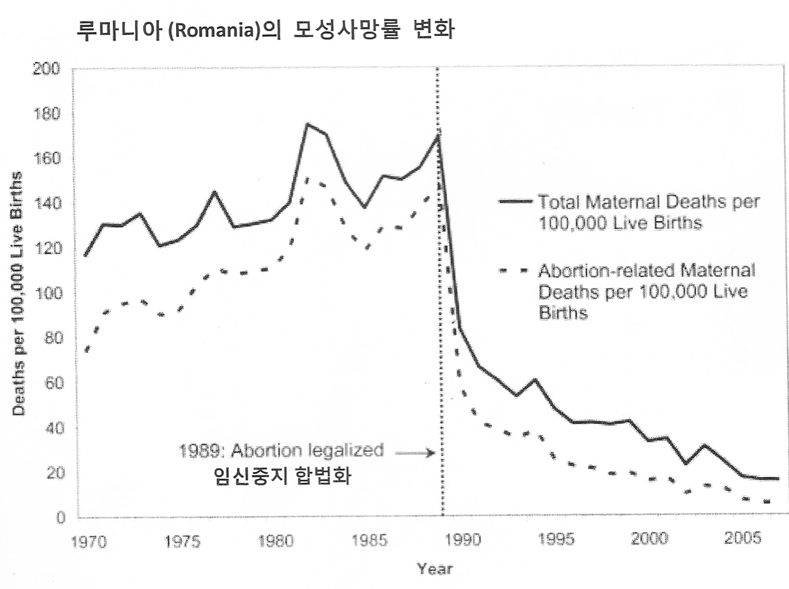
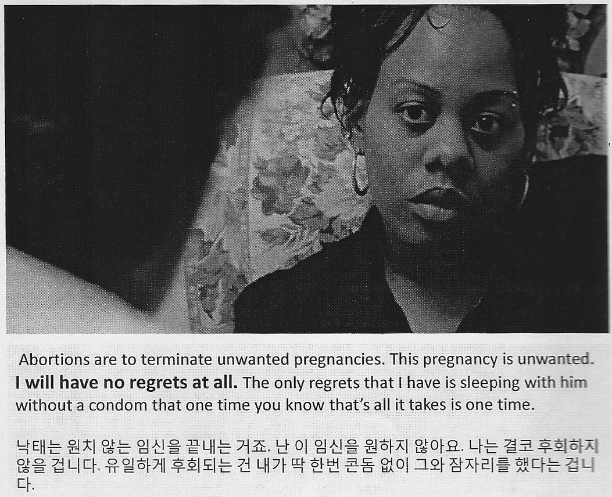

<h4 style="text-align:center"> 

<영화로 얘기해보는 ‘낙태죄’ 폐지와 재생산 정치, 두번째> ‘낙태죄’와 ‘Prolife’ _후니 

</h4>

<h5 style="text-align:center"> 

지구지역행동네트워크(NGA) 적녹보라 의제행동센터 상반기 특강

</h5>

행사 정보 보기(<a href="https://twitter.com/NGASF/status/902433006287175680" targt="_blank">링크</a>)

*이 녹취록의 내용은 NGA의 사전허가를 받고 게시합니다.  삽입된 사진은 행사 당일 배포된 스캔본에서 부분발췌했습니다.

*발언 내용중 구어적인 표현들 일부는 윤문하였습니다.

---

###### 의료적 방법들

조금 실제적인 얘기를 해볼게요. 임신중절에는 약물과 수술 두가지 방법이 있습니다. 임신 초기에는 상대적으로 약물을 이용한 방법이 안전하다고 알려져 있습니다. 하지만 한국에는 낙태죄가 불법이기 때문에 해당 약물들이 들어와 있지는 않죠.

미페프리스톤은 전혀 한국에 수입되어있지 않고, 미소프로스톨은 ‘소화제’로도 쓰이기 때문에 한국화이자사에서 ‘싸이토텍’이라는 이름으로 국내에 들어와있습니다. (다만, 이것은 전문의약품으로 분류되어 의사의 처방이 반드시 있어야 구입이 가능합니다. 때문에 낙태죄가 불법인 상황에서 이것만으로 임신중절에 성공하는 경우는 드물 것입니다.) 그림의 표 하단에도 써있지만, 미페프리스톤과 미소프로스톨을 동시에 복용했을 때 98%, 미소프로스톨만 복용했을 때는 90%의 낙태 성공률을 나타낸다고 합니다. 이는 응급피임약(사후피임약)보다 훨씬 더 높은 성공률이라고 보시면 됩니다.

이 두 약물에 대한 더 자세한 정보는 ‘파도 위의 여성들 (<a href="http://www.womenonweb.org">링크</a>)’ 사이트에 들어가시면 매우 자세하게 한국어로 보실 수 있습니다.

다음은 수술적 방법입니다. 아까 영화에서 보셨던 진공 흡입술부터 설명드리겠습니다. 흡입을 수동으로 하는지, 기계에서 연결해서 하는지에 따라 세부적으로 다시 분류가 되기도 합니다. 다음으로 경부확장 소파술이란, ‘경부(자궁의 목, 입구)’가 좁아져 있는 것을 기계를 이용해서 확장시킨 후 ‘긁어낸다’는 것을 말합니다. 마지막으로 경부확장 배출술에서 ‘배출’이란, ‘부수어서 끄집어낸다’ 혹은 ‘다 비워낸다.’는 것을 의미합니다. 기계에 이빨 같은 것이 달려있어서 뭔가를 잡기 좋게끔 설계되어 있어요. 프로라이프 측에서 보여주는 분절되어있는 태아의 사체들은 주로 이 ‘경부확장 배출술’ 시술을 시행한 이후의 모습들입니다.

초기 임신의 경우에는 주로 진공 흡입술이나 ‘큐렛’이라는 도구를 통해 조금만 긁어내는 시술을 진행하면, 5분내로 매우 간단한 임신중절을 마칠 수 있습니다. 시술자 입장에서는 이 시기에 산모의 건강에만 집중한는게 가능해요. 임신 기간이 오래 지속되며 만삭에 가까워질수록 시술은 더 복잡한 문제를 맞닥뜨립니다. 낙태죄가 불법인 상황에서는 산모가 임신사실을 감추는 일이 벌어지게 되고, 시간을 되도록 끌수 있는만큼 끌게 되는데, 오히려 이런 상황이 사람의 생명에 위협을 가하게 되는 것이죠.

그래프를 보시면 1989년의 임신중지 합법화이후 루마니아의 모성 사망률이 뚝 떨어진 것을 아실 수 있을거에요. 그 이전까지는 모성 사망의 원인이 안전하지 못한 임신중지 시술에 상당수 있었다고 합니다.

델러웨이12번가에 나오는 한 장면입니다. 빅토리아라는 24세의 여성이고 아이 둘의 어머니이며, 폭력적인 남편의 아내입니다. 세번째 임신은 원하지 않았기 때문에 낙태를 하러 온 상황인데, 상담자는 낙태를 하지 말라고 설득을 하려 합니다. ‘후회할 것이다.’라는 말로요. 그 설득에 대해서 빅토리아는 이렇게 답을 합니다.

> 낙태는 원치 않는 임신을 끝내는 거죠. 난 이 임신을 원하지 않아요. 나는 결코 후회하지 않을 겁니다. 유일하게 후회되는 건 내가 딱 한번 콘돔없이 그와 잠자리를 했다는 겁니다.

