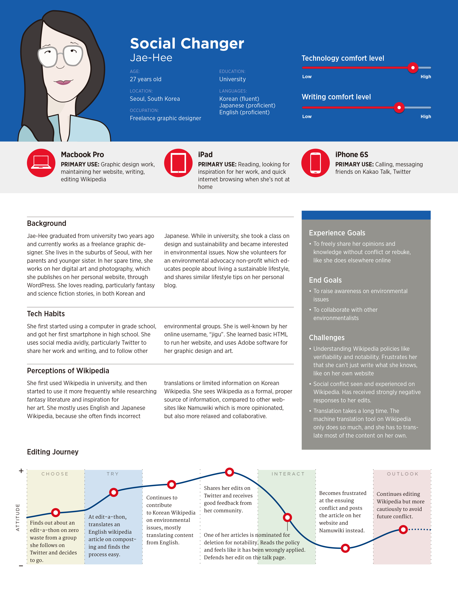

페미로그의 유체로서 2017년 5월 17일에 '새 사용자 경험(New Editor Experiences)' 프로젝트의 인터뷰를, 위키미디어 재단 (Wikimedia Foundation, Reboot)과 진행했습니다. 이 연구 프로젝트는 한국과 체코에서 진행되었으며, 2017년 8월에 1차 결과물이 발표된 상태입니다. 향후 "재단 임직원과 체코어/한국어 위키백과 사용자와의 워크샵 및 토론"을 통한 개발단계를 거쳐 심화연구 진행도 가능하다고 합니다.

---

- 프로젝트 소개페이지 <a href="https://www.mediawiki.org/wiki/New_Editor_Experiences/ko" targt="_blank"> 링크 </a>
- 연구에 기반한 새 사용자 인격 pdf(영문) <a href="https://meta.wikimedia.org/wiki/File:New_Editor_Experiences_user_personas,_August_2017.pdf" targt="_blank"> 링크 </a>

---

사용자들을 몇개의 인격으로 패턴화한 점이 특기할 만합니다. 저의 인터뷰 내용은 'Social Changer'인 'Jae-Hee'에 흡수된 것으로 보이는데, Feminism 대신에 Environmental Issue로 대체된 것은 아쉬운점이 있네요.